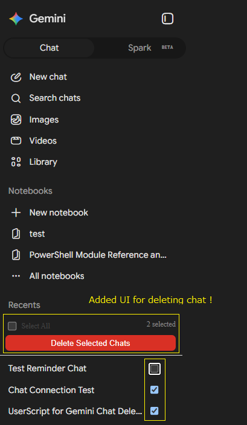

# Gemini Bulk Delete Chats

A Userscript that adds bulk deletion functionality to the Google Gemini (`https://gemini.google.com/`) sidebar chat history.

## Features

- **Checkboxes for Chat Items**: Adds selection checkboxes to each chat item in the "Recent" list on the sidebar.
- **Select All**: Toggle all loaded chats with a single click.
- **Live Counter**: Displays the number of currently selected chats in real time.
- **Automated Deletion**: Sequentially deletes selected chats automatically when you click "Delete Selected Chats".
- **Multi-Language Support**: Compatible with both English ("Delete") and Japanese ("削除") interface languages in Gemini.

## Prerequisites

A userscript manager extension installed in your browser is required:

- **Supported Browsers**: Google Chrome, Microsoft Edge, Mozilla Firefox, Brave, etc.
- **Recommended Extensions**:
  - [Violentmonkey](https://violentmonkey.github.io/) (Recommended)
  - [Tampermonkey](https://www.tampermonkey.net/)

## Installation

1. Install a userscript manager extension (Violentmonkey or Tampermonkey).
2. Install this script:
   - **From Greasy Fork**: *(Add Greasy Fork URL here once published)*
   - **Direct File**: Open [`gemini-bulk-delete.user.js`](gemini-bulk-delete.user.js) and confirm the installation in your userscript manager.

## Usage

1. Open [Google Gemini](https://gemini.google.com/).
2. A toolbar will appear at the top of the "Recent" chat list in the left sidebar.
3. Check the items you wish to delete, or check "Select All".
4. Click the **Delete Selected Chats** button to start deleting the selected conversations automatically.

## License

[MIT](LICENSE)
